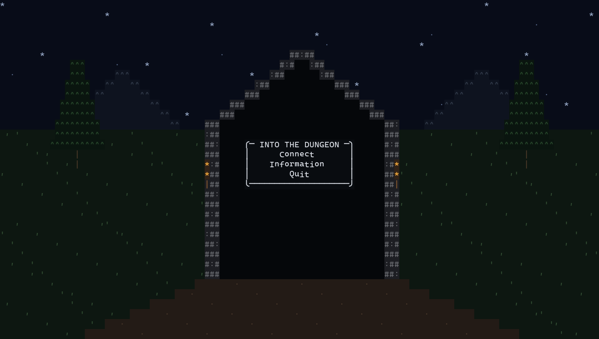
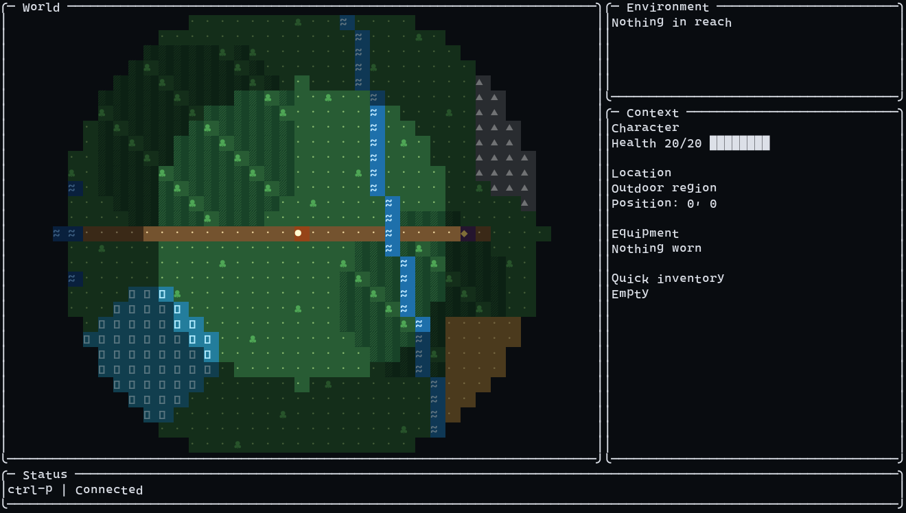

# Into the Dungeon

A small client-server role-playing game with a terminal user interface, written
in [Functional Pascal](https://github.com/tobiasbick/functional-pascal).

> **Disclaimer:** This is a hobby project at a very early stage. It is entirely
> vibe-coded, and we do not know where it will lead or whether it will ever
> reach an ending. It is also a practical test of Functional Pascal: can an LLM
> create a VM-based programming language and then use it to build something
> more substantial than "Hello, world"? Developing a real game exercises the
> language, compiler, virtual machine, standard library, and tooling together
> and exposes the bugs and missing pieces that small examples do not.

The current version has a TUI client connected to an authoritative game server,
with a generated, chunked outdoor world and a first-person dungeon view.

## Screenshots

**Start screen**



The start menu sits inside a torch-lit dungeon entrance. The surrounding
scenery is colored ASCII art generated to fit the current terminal size.

**Outdoor world**



The outdoor view shows the player among forests, grassland, water, mountains,
paths, and an entrance. Darker and hidden areas visualize the Fog of War.

> **Development note:** This is a staged preview of the outdoor renderer, not
> the current playable world. During this early development phase, the outdoor
> world primarily leads to a single dungeon entrance.

**Dungeon encounter**


Interiors use a grid-based first-person view rather than free movement. Here,
the player faces the restless skeleton in the initial dungeon.

```powershell
fpas run apps/server/server.fpasprj
fpas run apps/client/client.fpasprj
```

The source currently requires Functional Pascal revision `1df58c9e` or newer;
it uses `Std.Json.Fields`, `Std.Toml.Fields`, `Std.Fs.CreateDirAll`,
context-typed record updates such as `State with Hostiles := []; end`, and
`Cmd.RequestTick` for combat animation, which are available from that revision.

Run the server first. Both programs use `127.0.0.1:4040` by default and create
their TOML configuration under `~/.fpas-into-the-dungeon/config/`. Optional
host and port arguments override that address; `--data-dir PATH` selects a
different runtime-data directory.
The server also accepts `--world ID` to select or create another world.

Inspect terrain or an individual generator field without starting the server:

```powershell
fpas run tools/world-preview/world-preview.fpasprj -- terrain
fpas run tools/world-preview/world-preview.fpasprj -- continentalness
```

See the [architecture overview](docs/architecture/overview.md) for the planned
repository structure and the [roadmap](docs/roadmap.md) for the incremental
development order. Functional Pascal's
[language documentation](https://github.com/tobiasbick/functional-pascal/tree/main/docs/pascal)
is the source of truth for the implementation.

Contributions are described in [CONTRIBUTING.md](CONTRIBUTING.md).

## License

[BSD-3-Clause](LICENSE)
